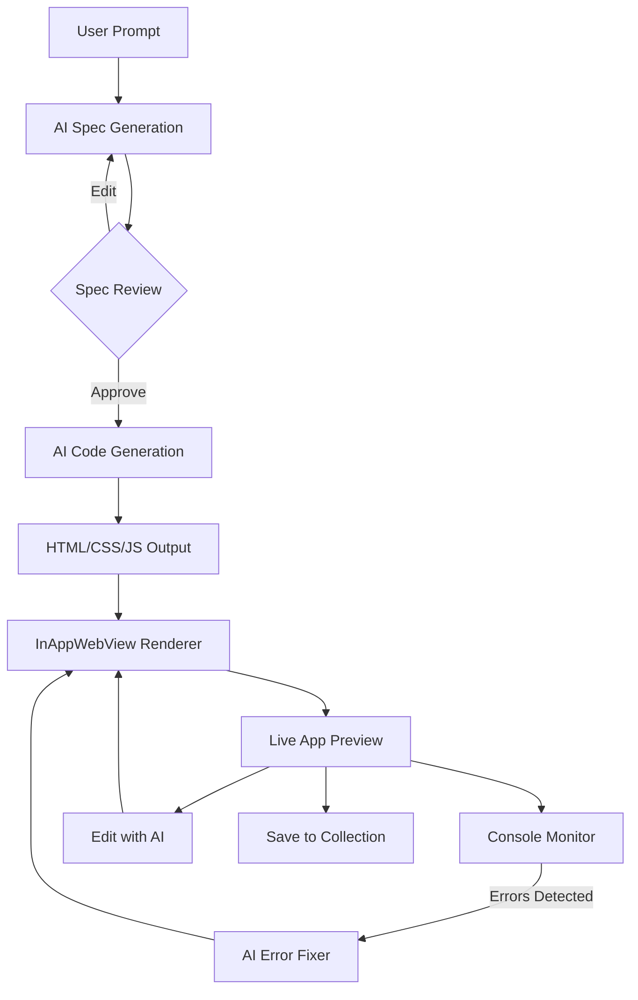

# YourApp

## Overview
YourApp is an AI-powered **mobile IDE and application builder** that allows users to generate fully functional web apps within the same app. Instead of searching through app stores for solutions that may lack customization, updates, or essential features, users can create their own tailored applications using a simple prompt-based system. 


## Features
- **Spec-Driven AI Generation**: Two-step process — AI creates a structured spec first, then generates code from the approved spec
- **Editable Specs**: Review, edit, and regenerate specs before code generation
- **AI-Powered Code Generation**: Generates complete single-file HTML apps with Tailwind CSS + daisyUI 5 theming
- **Runtime Console Monitor**: Built-in console log viewer that captures errors, warnings, and logs from generated apps in real-time
- **AI Error Fixing**: Detected runtime errors can be automatically fixed by AI with one tap
- **Customization & Editing**: Modify generated apps with natural language edit instructions
- **Offline Support**: Save generated apps for future use without consuming additional AI tokens
- **Device Storage Access**: Generated apps can access file picker and device media


## Architecture



## Tech Stack

- **Flutter** - Native mobile app shell
- **Firebase AI (Gemini)** - AI model for spec and code generation
- **InAppWebView** - Renders generated web apps
- **Tailwind CSS + daisyUI 5** - Styling framework for generated apps (dark theme, responsive, accessible)
- **CDN-based dependencies** - React, Babel, and other libraries loaded via CDN

## Usage
1. **Enter a prompt** describing the app you want to generate
2. **Review the spec** — edit data models, UI layout, or features as needed
3. **Approve the spec** to trigger code generation
4. **Preview the app** in the built-in browser
5. **Monitor the console** for any runtime errors
6. **Edit with AI** using natural language instructions
7. **Save to collection** for offline access


> **This is not a one-click app-building solution but more like an AI-based mobile IDE, providing a workspace for generating and refining applications.**

## Limitations
- **Complex Applications**: Cannot build sophisticated apps requiring multi-user interactions (e.g., marketplaces) or complex backends
- **No SVG Support**: Apps that rely on SVG rendering (such as games) may not work properly
- **AI Accuracy**: Results may sometimes be inaccurate and require spec edits or manual fixes
- **Browser-Based Execution**: Only supports features available in a browser environment
- **CDN-Only Dependencies**: Cannot use npm packages, limiting available libraries

## How to Contribute
1. **Fork the Repository**: Start by forking the project on GitHub.
2. **Clone the Repository**: Clone it to your local machine using:
   ```sh
   git clone https://github.com/Adhishtanaka/yourapp.git
   ```
3. **Create a Branch**: Create a new branch for your changes:
   ```sh
   git checkout -b feature-branch-name
   ```
4. **Make Changes**: Implement your improvements or bug fixes.
5. **Commit Your Changes**: Write a clear commit message:
   ```sh
   git commit -m "Added feature XYZ"
   ```
6. **Push to GitHub**: Push your changes:
   ```sh
   git push origin feature-branch-name
   ```
7. **Submit a Pull Request**: Open a PR describing your changes.
8. **Review & Merge**: Wait for review and approval before merging.

## Contact
- **Author**: [Adhishtanaka](https://github.com/Adhishtanaka)
- **Email**: kulasoooriyaa@gmail.com

## License
This project is licensed under the MIT License. See [LICENSE](LICENSE) for details.
